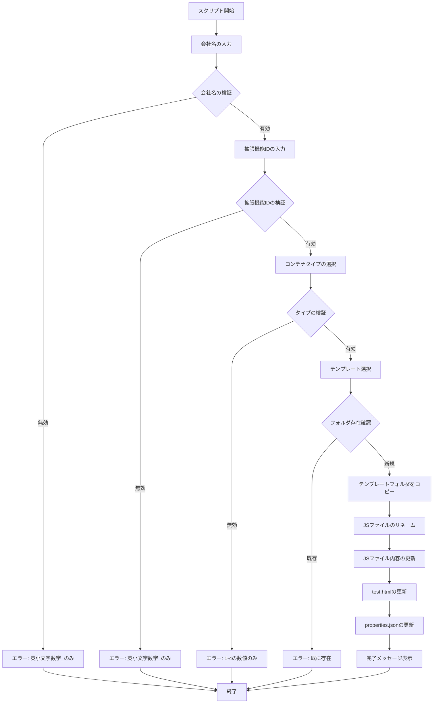
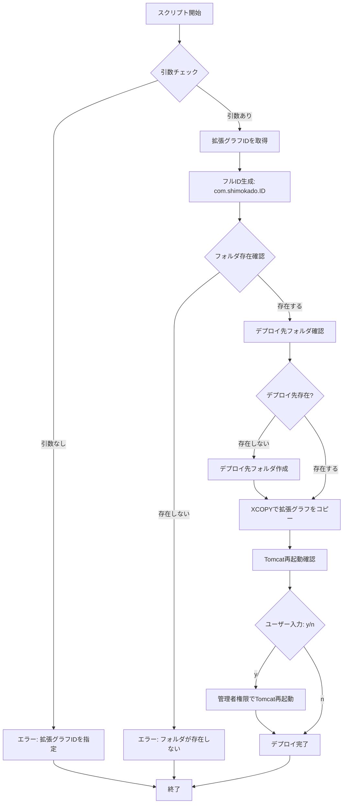
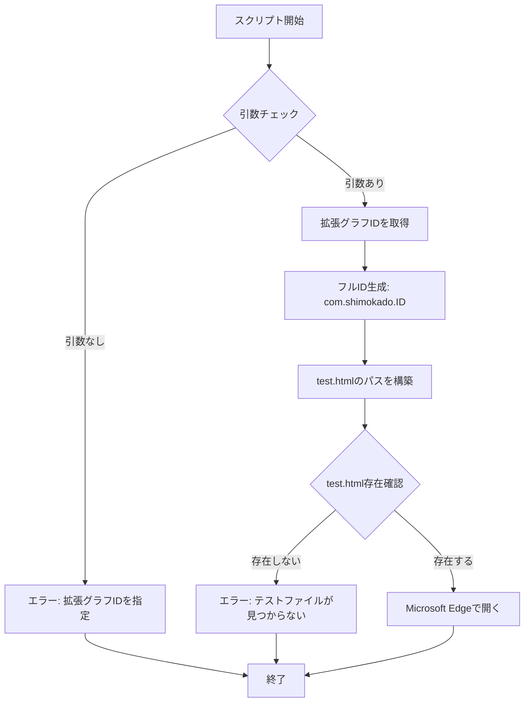
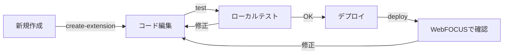

# toolフォルダ 仕様書

## 概要

`tool`フォルダには、WebFOCUS拡張グラフの開発を支援するユーティリティスクリプトが格納されています。これらのツールを使用することで、新規拡張グラフの作成、テスト、デプロイを効率的に行うことができます。

## ファイル構成

```
tool/
├── create-extension.js          # 拡張グラフ作成のメインスクリプト（Node.js）
├── create_extension_module.bat  # 拡張グラフ作成のバッチラッパー
├── deploy_extension_module.bat  # WebFOCUSへのデプロイスクリプト
└── test_extension_module.bat    # ローカルテストスクリプト
```

---

## 1. create-extension.js

### 概要
新しいWebFOCUS拡張グラフのスケルトンを自動生成するNode.jsスクリプトです。既存のテンプレートフォルダをコピーし、IDやファイル名を適切にリネームします。

### 機能
- 対話形式での拡張グラフ情報の入力
- テンプレートフォルダの複製
- ファイルの自動リネーム
- JavaScriptファイル、HTML、JSONの内容更新

### 使用方法

#### 直接実行
```bash
node tool/create-extension.js
```

#### npm script経由（推奨）
```bash
npm run create-extension
```

### 実行フロー



### 入力パラメータ

| パラメータ | 説明 | 形式 | 例 |
|-----------|------|------|-----|
| 会社名 | 拡張グラフIDのプレフィックス | 英小文字、数字、アンダースコアのみ | `shimokado` |
| 拡張グラフID | 拡張グラフの識別子 | 英小文字、数字、アンダースコアのみ | `custom_bar` |
| コンテナタイプ | 使用するライブラリ | 1-4の数値 | `1` (D3.js) |

### コンテナタイプ一覧

| 番号 | ライブラリ | テンプレートフォルダ | 用途 |
|-----|-----------|-------------------|------|
| 1 | D3.js | `com.shimokado.d3_sample` | SVGベースの高度なビジュアライゼーション |
| 2 | Chart.js | `com.shimokado.chartjs_sample` | シンプルなチャート（棒・折れ線・円など） |
| 3 | HTML | `com.shimokado.html_sample` | カスタムHTML要素、テーブル、カード等 |
| 4 | ApexCharts | `com.shimokado.apexchart_bar` | モダンでインタラクティブなチャート |

### 出力

成功時、以下の形式でフォルダが作成されます：

```
com.{company}.{extension_id}/
├── com.{company}.{extension_id}.js
├── properties.json
├── test.html
├── css/
├── lib/
└── icons/
```

### 実装の詳細

#### 主要な関数

##### `copyFolderRecursiveSync(source, target)`
- **目的**: ディレクトリを再帰的にコピー
- **引数**: 
  - `source` (string): コピー元パス
  - `target` (string): コピー先パス
- **動作**: サブディレクトリとファイルを再帰的に複製

##### `updateJsFile(filePath, newId, oldTemplateId)`
- **目的**: JavaScriptファイルの拡張グラフIDを更新
- **引数**:
  - `filePath` (string): 更新対象ファイルパス
  - `newId` (string): 新しい拡張グラフID
  - `oldTemplateId` (string): テンプレートのID
- **動作**: 
  - `config.id = '...'` の値を置換
  - ファイル内の全てのテンプレートIDを新IDに置換

##### `updateTestHtmlTitle(filePath, newTitle)`
- **目的**: test.htmlの`<title>`タグを更新
- **引数**:
  - `filePath` (string): test.htmlのパス
  - `newTitle` (string): 新しいタイトル
- **動作**: `<title>...</title>` を `<title>{newTitle} Test</title>` に置換

##### `updatePropertiesJson(filePath, newId, oldId)`
- **目的**: properties.jsonの翻訳情報を更新
- **引数**:
  - `filePath` (string): properties.jsonのパス
  - `newId` (string): 新しい拡張グラフID
  - `oldId` (string): 古いテンプレートID
- **動作**: `translations.en.icon_tooltip` と `translations.ja.icon_tooltip` 内のIDを置換

### エラーハンドリング

| エラーメッセージ | 原因 | 対処法 |
|----------------|------|--------|
| `Company name cannot be empty!` | 会社名が未入力 | 会社名を入力してください |
| `Company name must contain only lowercase alphanumeric characters and underscores!` | 会社名に不正な文字 | 英小文字、数字、`_`のみ使用 |
| `Extension ID cannot be empty!` | 拡張グラフIDが未入力 | 拡張グラフIDを入力してください |
| `Extension ID must contain only lowercase alphanumeric characters and underscores!` | 拡張グラフIDに不正な文字 | 英小文字、数字、`_`のみ使用 |
| `Invalid container type!` | コンテナタイプが1-4以外 | 1, 2, 3, 4 のいずれかを入力 |
| `Extension {name} already exists!` | 同名のフォルダが既に存在 | 別の名前を使用するか、既存フォルダを削除 |

---

## 2. create_extension_module.bat

### 概要
`create-extension.js`を実行するための簡易バッチファイルラッパーです。

### 使用方法
```cmd
tool\create_extension_module.bat
```

または

```cmd
npm run create-extension
```

### 実装内容
```batch
@echo off
node "%~dp0\create-extension.js"
```

- `%~dp0`: バッチファイルの存在するディレクトリパスを取得
- Node.jsで`create-extension.js`を実行

---

## 3. deploy_extension_module.bat

### 概要
指定した拡張グラフをWebFOCUSサーバーのextensionsフォルダにデプロイするバッチスクリプトです。

### 使用方法

#### コマンドライン実行
```cmd
tool\deploy_extension_module.bat [extension_id]
```

#### npm script経由
```cmd
npm run deploy [extension_id]
```

### 引数

| 引数 | 説明 | 必須 | 例 |
|-----|------|-----|-----|
| extension_id | デプロイする拡張グラフのID（`com.shimokado.`を除く） | ✅ | `custom_bar` |

### 実行フロー



### 設定

#### デプロイ先パス
デフォルト: `C:\ibi\WebFOCUS93\config\web_resource\extensions`

> **注意**: WebFOCUSのバージョンに応じて、スクリプト内の`WebFOCUS93`部分を変更する必要があります。

#### Tomcatサービス名
デフォルト: `Tomcat9WF`

### 使用例

```cmd
# card_simpleをデプロイ
tool\deploy_extension_module.bat card_simple

# Tomcat再起動の確認が表示される
Do you want to restart Tomcat? [y/n]
y
```

### 注意事項

1. **管理者権限**: Tomcat再起動には管理者権限が必要です
2. **パスの確認**: WebFOCUSのインストールパスが異なる場合は、スクリプト内の`DEPLOY_FOLDER`を編集してください
3. **バックアップ**: デプロイ前に既存の拡張グラフをバックアップすることを推奨します

---

## 4. test_extension_module.bat

### 概要
指定した拡張グラフの`test.html`をEdgeブラウザで開いてローカルテストを実行するバッチスクリプトです。

### 使用方法

#### コマンドライン実行
```cmd
tool\test_extension_module.bat [extension_id]
```

#### npm script経由
```cmd
npm run test [extension_id]
```

### 引数

| 引数 | 説明 | 必須 | 例 |
|-----|------|-----|-----|
| extension_id | テストする拡張グラフのID（`com.shimokado.`を除く） | ✅ | `custom_bar` |

### 実行フロー



### 使用例

```cmd
# card_simpleをテスト
tool\test_extension_module.bat card_simple

# Edgeブラウザが起動してtest.htmlが表示される
```

### ブラウザ設定

デフォルト: Microsoft Edge (`msedge`)

> 他のブラウザを使用したい場合は、スクリプト内の`start msedge`を変更してください：
> - Chrome: `start chrome`
> - Firefox: `start firefox`

### デバッグのヒント

ブラウザを開いた後：
1. **開発者ツールを開く（F12）**
2. **コンソールでエラーを確認**
3. **Networkタブでリソース読み込みを確認**
4. **Elementsタブで描画結果を確認**

---

## 開発ワークフロー

### 典型的な使用パターン



### ステップバイステップ

#### 1. 新規拡張グラフの作成
```cmd
npm run create-extension
```
- 会社名: `mycompany`
- 拡張グラフID: `my_chart`
- コンテナタイプ: `1` (D3.js)

#### 2. コードの編集
- `com.mycompany.my_chart/com.mycompany.my_chart.js` を編集
- `com.mycompany.my_chart/properties.json` を編集

#### 3. ローカルテスト
```cmd
npm run test my_chart
```
- ブラウザで動作確認
- デバッグツールでエラーチェック

#### 4. デプロイ
```cmd
npm run deploy my_chart
```
- Tomcat再起動: `y`

#### 5. WebFOCUSで確認
- WebFOCUS環境でチャートを作成
- 本番データで動作確認

---

## トラブルシューティング

### よくある問題

#### 1. create-extensionが動作しない

**症状**: `'node' is not recognized as an internal or external command`

**原因**: Node.jsがインストールされていない、またはPATHが通っていない

**対処法**:
- Node.jsをインストール: https://nodejs.org/
- 環境変数PATHにNode.jsを追加

#### 2. deployが失敗する

**症状**: `Extension folder does not exist`

**原因**: 指定した拡張グラフフォルダが見つからない

**対処法**:
- 拡張グラフIDが正しいか確認
- `com.shimokado.`プレフィックスを**除いた**IDを指定

#### 3. test.htmlが開かない

**症状**: ブラウザは開くが真っ白

**原因**: JavaScriptエラー、またはリソース読み込み失敗

**対処法**:
- F12で開発者ツールを開く
- Consoleタブでエラーメッセージを確認
- `tdgchart-min-for-test.js`が正しく読み込まれているか確認

#### 4. デプロイ後にエラー

**症状**: WebFOCUSでチャートが表示されない

**対処法**:
1. `html5chart_extensions.json`に拡張グラフが登録されているか確認
2. Tomcatが正しく再起動されたか確認
3. ブラウザのキャッシュをクリア

---

## セキュリティ上の注意

### 管理者権限
- `deploy_extension_module.bat`のTomcat再起動には管理者権限が必要です
- 信頼できる環境でのみ実行してください

### パス検証
- これらのスクリプトは入力値の検証を行っていますが、WebFOCUSサーバーへの書き込み権限には注意してください

---

## まとめ

`tool`フォルダのスクリプトは、WebFOCUS拡張グラフ開発の生産性を大幅に向上させます：

| ツール | 主な用途 | 対象ユーザー |
|-------|---------|------------|
| create-extension.js | 新規拡張グラフの雛形作成 | 全開発者 |
| test_extension_module.bat | ローカルでの動作確認 | 全開発者 |
| deploy_extension_module.bat | WebFOCUSへの配置 | デプロイ担当者 |

これらのツールを活用して、効率的な開発サイクルを実現してください。
